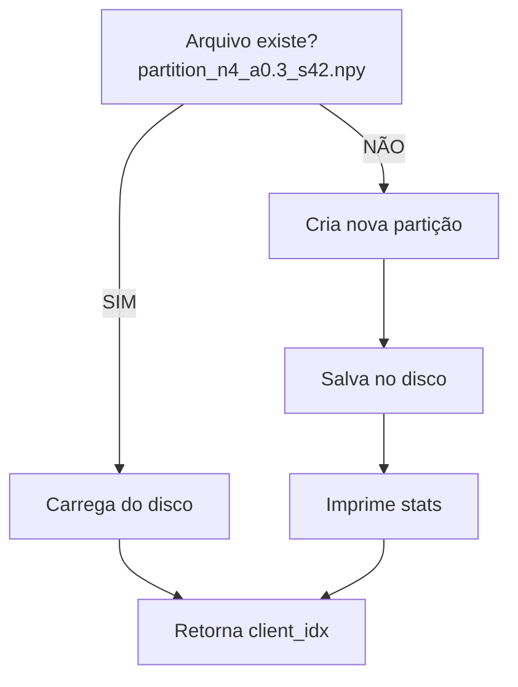

# DataLoader -> ```dataloader.py```

Implementação de um DataLoader baseado em particionamento Dirichlet para dados não-IID com balanceamento de classes. Por enquanto, apenas para o dataset CIFAR-10.


Em cenários de Aprendizado Federado, os dados dos clientes são heterogêneos (não-IID):

* Hospital A pode ter mais casos da doença A
* Hospital B pode ter mais casos da doença B

Esta seção ajuda a entender o DataLoader que simula essa heterogeneidade de forma controlada e reproduzível.

## Parâmetro Alpha (α)

O parâmetro Alpha (α) controla o nível de heterogeneidade:

| Alpha (α)  | Distribuição            | Descrição                                                   |
|-------------|------------------------|--------------------------------------------------------------|
| α → 0       | Muito heterogêneo       | Cada cliente tem poucas classes dominantes                   |
| α = 0.1     | Altamente não-IID       | Cenário muito desbalanceado                                  |
| α = 0.3     | Moderadamente não-IID   |  **Valor padrão – realista**                                |
| α = 0.5     | Levemente não-IID       | Alguma variação entre clientes                               |
| α = 1.0     | Quase balanceado        | Distribuição mais uniforme                                   |
| α → ∞       | IID perfeito            | Todos os clientes têm mesma distribuição                     |


## Funções Principais

### ```partition_data_dirichlet(dataset, num_clients, alpha, seed)```

* Objetivo: Particionar o dataset usando a distribuição de Dirichlet.

* Como funciona:
    * Para cada classe k (0 a 9 no caso do CIFAR-10):
        * 1 - Pega todos os índices das amostras da classe k
        * 2 - Embaralha os índices
        * 3 - Gera proporções usando Dirichlet: [p1m p2, ..., pn]
        Exemplo: [0.05, 0.15, 0.60, 0.20] para 4 clientes; ou seja, cliente 1 fica com 5% das amostras da classe k, cliente 2 fica com 15% e assim por diante
        * 4 - Divide os índices segundo essas proporções
        * 5 - Atribui cada parte a um cliente diferente

Exemplo visual (4 clientes, classe 0 com 5000 amostras, α=0.3):

Classe 0: ```[img_0, img_1, img_2, ..., img_4999]```, ```Dirichlet(α=0.3)```
Proporções: ```[0.05, 0.15, 0.60, 0.20]```
                    
Cliente 0: 250 imagens  (5%)  ████░░░░░░░░░░░░░░░░
Cliente 1: 750 imagens  (15%) ████████████░░░░░░░░
Cliente 2: 3000 imagens (60%) ████████████████████
Cliente 3: 1000 imagens (20%) ████████████████░░░░


### ```get_or_create_partition(num_clients, alpha, seed)```


Objetivo: Salvar as partições de dados

Essa função evita recalcular as partições a cada execução do simulador e também mantém a mesma partição em todas as rodadas.



Exemplo de output: 
Partição salva em: ```data/splits_dirichlet/partition_n4_a0.3_s42.npy```
  Cliente 0: 9799 amostras - Classes: {0: 523, 1: 1456, 2: 234, ...}
  Cliente 1: 11844 amostras - Classes: {0: 1234, 1: 456, 2: 2345, ...}
  Cliente 2: 15726 amostras - Classes: {0: 2345, 1: 234, 2: 3456, ...}
  Cliente 3: 12631 amostras - Classes: {0: 898, 1: 1354, 2: 1965, ...}

### ```get_client_id_from_site_name(site_name)```

Objetivo: Converte nome do site (nome do cliente, mas está padronizado como site-1, site-2, ..., site-n) em ID numérico.

Mapeamento:

```"site-1 -> 0"```
```"site-2 -> 1"```
```"site-3 -> 2"```

### ```load_train_data(site_name, batch_size, num_clients, alpha)```

Objetivo: Carregar os dados de treino específicos de cada cliente

Pipeline:

```1. Extrai client_id do site_name
   "site-2" → client_id = 1

2. Carrega CIFAR-10 completo (50,000 imagens)
   Com transformações de data augmentation

3. Obtém partição Dirichlet
   client_idx = {0: [...], 1: [...], 2: [...], 3: [...]}

4. Cria Subset com índices do cliente
   indices = client_idx[1] 

5. Cria DataLoader com shuffle
   → Retorna mini-batches para treinamento
```


